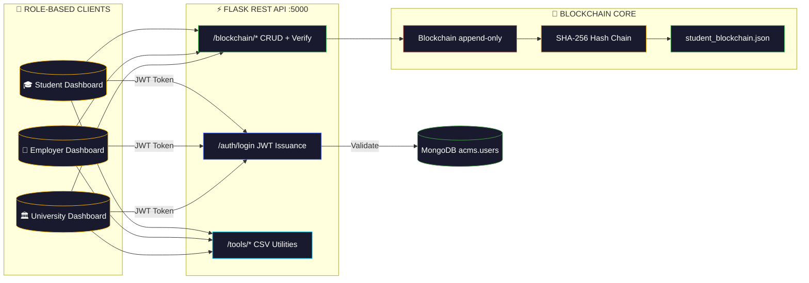

<div align="center">

<!-- Animated Header Banner -->


<!-- Animated Typing SVG -->
<a href="https://github.com/SKYLINE217/blockchain--BATA-">
  
</a>

<br/>


</div>

---

> [!CAUTION]
> **Research & Demo Only** — This is a mock blockchain implementation for academic portfolio purposes. It does not implement a real distributed consensus mechanism. **Not intended for production use.**

---

## 🌐 Overview

**Blockchain Credential System** (BATA Project) is a decentralised academic credential issuance and verification platform using **cryptographic hashing** and an **immutable append-only ledger** to ensure tamper-proof academic records.

| | |
|:---:|:---|
| 🔗 **Blockchain Core** | SHA-256 hashing, immutable ledger, hash-chain continuity |
| 🔐 **Auth** | MongoDB-backed JWT login with role-gated dashboards |
| ⚡ **API** | Flask REST endpoints for credential CRUD + CSV tools |
| 📊 **Verification** | Chain integrity check, tamper detection, per-student history |
| 💾 **Persistence** | `student_blockchain.json` + MongoDB (`acms.users`) |

---

## 🏗️ Architecture



### 🔗 Block Structure

```json
{
  "student_record": { "student_id": "...", "degree": "...", "grade": "..." },
  "timestamp": 1722800000.123,
  "previous_hash": "a3f7b2c1...",
  "hash": "d9e4f1a8..."
}
```

---

## 🔑 Key Features

| Feature | Description |
|:---:|:---|
| 🔗 **Immutable Ledger** | SHA-256 hash-chained blocks — no overwrite, append-only |
| 🔄 **Update Mechanism** | Corrections appended as new blocks preserving full history |
| ✅ **Chain Verification** | Detect tampering across the full credential chain |
| 🔐 **JWT Auth** | MongoDB-backed login for Student / Employer / University roles |
| 📦 **CSV Toolchain** | Generate, hash, import, verify CSVs against the blockchain |

---

## 🔐 Role-Based Access Control

| Role | Permissions |
|:---|:---|
| 🎓 **Student** | View own credentials |
| 🏢 **Employer** | Verify any credential |
| 🏛️ **University** | Issue & upload credentials |

---

## 🔌 API Endpoints

| Method | Endpoint | Description | Auth |
|:---:|:---|:---|:---:|
| `POST` | `/blockchain/add` | Add a new credential block | `X-API-Key` |
| `POST` | `/blockchain/update` | Append a correction block | `X-API-Key` |
| `GET` | `/blockchain/verify` | Verify chain integrity | — |
| `GET` | `/blockchain/student/{student_id}` | Get student block history | — |
| `GET` | `/blockchain/chain` | Full chain dump | — |
| `GET` | `/blockchain/info` | Summary (length, latest, validity) | — |
| `GET` | `/health` | Service health | — |
| `POST` | `/auth/login` | Authenticate user with role | — |
| `POST` | `/tools/generate_csv` | Generate demo records CSV | `X-API-Key` |
| `POST` | `/tools/hash_csv` | Create hashed CSV | `X-API-Key` |
| `POST` | `/tools/import_csv` | Import CSV into blockchain | `X-API-Key` |
| `POST` | `/tools/verify_csv` | Compare CSV against hashed CSV | — |
| `POST` | `/university/upload` | Upload CSV file | `X-API-Key` |
| `GET` | `/verify/enrollment/{student_id}` | Retrieve current synthesised record | — |

---

## 🚀 Installation & Usage

```bash
# 1. Clone the repository
git clone https://github.com/SKYLINE217/blockchain--BATA-.git
cd blockchain--BATA-

# 2. Install dependencies
pip install -r requirements.txt

# 3. Start MongoDB (default: mongodb://localhost:27017/)

# 4. Run in development
python app.py

# 5. Run in production (Waitress)
waitress-serve --host=0.0.0.0 --port=5000 app:app

# 6. Test
python test_api.py
python security_test.py
```

---

## 🔒 Security Features

| Feature | Implementation |
|:---|:---|
| **SHA-256 Hashing** | Every block cryptographically linked to its predecessor |
| **Tamper Detection** | `verify_chain()` recomputes all hashes and checks continuity |
| **Append-Only Updates** | Corrections create new blocks — original data preserved |
| **API Key Protection** | Write operations require `X-API-Key` header |
| **JWT Auth** | Role-based dashboard access controlled by signed tokens |

---

<div align="center">


[](https://github.com/SKYLINE217)

*Built with ❤️ for decentralised trust.*

</div>
